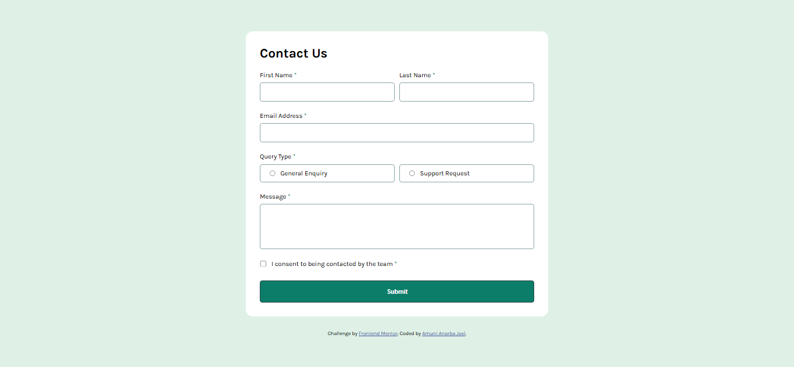

# Frontend Mentor - Contact form solution

This is my solution to the [Contact form challenge on Frontend Mentor](https://www.frontendmentor.io/challenges/contact-form--G-hYlqKJj). This project helped me practice form validation, accessibility features, and responsive design.

## Table of contents

- [Overview](#overview)
  - [The challenge](#the-challenge)
  - [Screenshot](#screenshot)
  - [Links](#links)
- [My process](#my-process)
  - [Built with](#built-with)
  - [What I learned](#what-i-learned)
  - [Continued development](#continued-development)
  - [Useful resources](#useful-resources)
- [Author](#author)
- [Acknowledgments](#acknowledgments)

## Overview

### The challenge

Users should be able to:

- Complete the form and see a success toast message upon successful submission
- Receive form validation messages if:
  - A required field has been missed
  - The email address is not formatted correctly
- Complete the form only using their keyboard
- Have inputs, error messages, and the success message announced on their screen reader
- View the optimal layout for the interface depending on their device's screen size
- See hover and focus states for all interactive elements on the page

### Screenshot

### Links

- Solution URL: [https://github.com/joelanarba/contact-form](https://github.com/joelanarba/contact-form)
- Live Site URL: [https://joelanarba.github.io/contact-form/](https://joelanarba.github.io/contact-form/)

## My process

### Built with

- Semantic HTML5 markup
- CSS custom properties
- Flexbox
- CSS Grid
- Mobile-first workflow
- JavaScript (for form validation & interactions)

### What I learned

During this project, I strengthened my understanding of:

- Form validation using JavaScript.

- Accessibility considerations, including ARIA attributes.

- Responsive design techniques using Flexbox and Grid.

- Handling form submission events and error handling.

### Continued development

In future projects, I want to:

- Implement real-time form validation feedback.

- Explore form submission handling with a backend API.

- Improve accessibility using more advanced ARIA roles and attributes.

### Useful resources

- [MDN Web Docs - Form Validation](https://developer.mozilla.org/en-US/docs/Learn_web_development/Extensions/Forms/Form_validation) - Helped me understand client-side form validation.
- [CSS-Tricks - Flexbox Guide](https://css-tricks.com/snippets/css/a-guide-to-flexbox/) - This is an amazing article which helped me finally understand XYZ. I'd recommend it to anyone still learning this concept.

## Author

- Frontend Mentor - [@joelanarba](https://www.frontendmentor.io/profile/joelanarba)
- LinkedIn - [@joelanarba](https://www.linkedin.com/in/joelanarba/)
- Twitter - [@joel_anarba](https://x.com/joel_anarba)

## Acknowledgments

Thanks to the Frontend Mentor community for providing a great platform to practice real-world projects!
